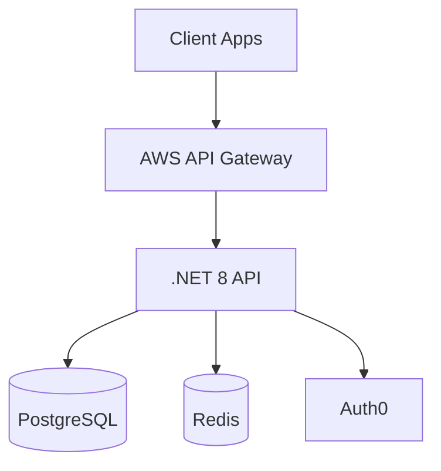
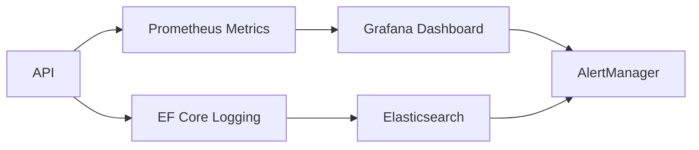

 
---

# Acme Design Services API Capstone Documentation  
**Technical Stack**: C#/.NET 8, PostgreSQL 15, Redis 7, AWS EKS  
**CI/CD**: GitHub Actions → ECR → ArgoCD  
**Security**: Auth0 JWT Validation, Redis Rate Limiting  



---

## 1. Local Development Setup

### 1.1 Prerequisites
```bash
# Install .NET 8 SDK
wget https://dot.net/v1/dotnet-install.sh -O dotnet-install.sh
chmod +x ./dotnet-install.sh
./dotnet-install.sh --version 8.0.300

# Start dependencies
docker-compose -f docker-compose.dev.yml up -d
```

### 1.2 Solution Structure
```
Acme.DesignApi/
├── Acme.DesignApi.sln
├── src/
│   ├── Acme.DesignApi.Core/          # Domain Models
│   ├── Acme.DesignApi.Infra/         # Database Context
│   ├── Acme.DesignApi.Web/           # API Controllers
│   └── Acme.DesignApi.Worker/        # Background Services
└── tests/
    └── Acme.DesignApi.UnitTests/     # xUnit Tests
```

---

## 2. Core Domain Models

### 2.1 Appointment Entity
```csharp
public class Appointment : EntityBase
{
    public DateTime StartTime { get; set; }
    public DateTime EndTime { get; set; }
    public AppointmentStatus Status { get; set; }
    
    [ForeignKey("DesignConsultantId")]
    public Guid DesignConsultantId { get; set; }
    public DesignConsultant Consultant { get; set; }
}

public enum AppointmentStatus 
{
    Scheduled,
    Completed,
    Cancelled
}
```

---

## 3. API Endpoints Implementation

### 3.1 Appointments Controller
```csharp
[ApiController]
[Route("api/[controller]")]
[Authorize(AuthenticationSchemes = JwtBearerDefaults.AuthenticationScheme)]
public class AppointmentsController : ControllerBase
{
    [HttpPost]
    [EnableRateLimiting("api-rate-limit")]
    public async Task CreateAppointment(
        [FromBody] CreateAppointmentRequest request)
    {
        var appointment = _mapper.Map(request);
        await _context.Appointments.AddAsync(appointment);
        await _context.SaveChangesAsync();
        return CreatedAtAction(nameof(GetById), 
            new { id = appointment.Id }, appointment);
    }
}
```

### 3.2 Rate Limiting Configuration
```csharp
services.AddRateLimiter(options => 
{
    options.AddPolicy("api-rate-limit", context =>
        RateLimitPartition.GetFixedWindowLimiter(
            partitionKey: context.User.Identity?.Name,
            factory: _ => new FixedWindowRateLimiterOptions
            {
                PermitLimit = 100,
                Window = TimeSpan.FromMinutes(1)
            }));
});
```

---

## 4. Infrastructure Configuration

### 4.1 PostgreSQL Context
```csharp
public class DesignContext : DbContext
{
    public DbSet Appointments { get; set; }
    
    protected override void OnConfiguring(
        DbContextOptionsBuilder optionsBuilder)
    {
        optionsBuilder.UseNpgsql(
            Configuration.GetConnectionString("DesignDb"));
    }
}
```

### 4.2 Redis Caching
```csharp
services.AddStackExchangeRedisCache(options =>
{
    options.Configuration = Configuration.GetValue("Redis:ConnectionString");
    options.InstanceName = "AcmeDesign_";
});
```

---

## 5. Deployment Pipeline

### 5.1 GitHub Actions Workflow
```yaml
name: Acme API Deployment

on:
  push:
    branches: [ main ]

jobs:
  build:
    runs-on: ubuntu-latest
    steps:
    - uses: actions/checkout@v4
      
    - name: Setup .NET
      uses: actions/setup-dotnet@v3
      with:
        dotnet-version: 8.0.x

    - name: Build
      run: dotnet build --configuration Release
      
    - name: Publish
      run: dotnet publish -c Release -o published

  deploy:
    needs: build
    runs-on: ubuntu-latest
    environment: production
    steps:
    - name: Deploy to EKS
      uses: aws-actions/amazon-eks-deploy@v1
      with:
        cluster-name: acme-design-cluster
        manifest-file: k8s/deployment.yml
```

---

## 6. Kubernetes Deployment

### 6.1 EKS Deployment Manifest
```yaml
apiVersion: apps/v1
kind: Deployment
metadata:
  name: acme-design-api
spec:
  replicas: 3
  selector:
    matchLabels:
      app: design-api
  template:
    metadata:
      labels:
        app: design-api
    spec:
      containers:
      - name: design-api
        image: 123456789012.dkr.ecr.us-west-2.amazonaws.com/acme-design-api:latest
        ports:
        - containerPort: 8080
        envFrom:
        - configMapRef:
            name: design-api-config
---
apiVersion: v1
kind: ConfigMap
metadata:
  name: design-api-config
data:
  ConnectionStrings__DesignDb: "Host=acme-design-db;Database=design_prod;..."
  Redis__ConnectionString: "acme-design-redis:6379"
```

---

## 7. Monitoring & Observability



### 7.1 Health Check Endpoint
```csharp
app.MapHealthChecks("/health", new HealthCheckOptions {
    ResponseWriter = UIResponseWriter.WriteHealthCheckUIResponse
});

services.AddHealthChecks()
    .AddNpgSql(Configuration.GetConnectionString("DesignDb"))
    .AddRedis(Configuration.GetConnectionString("Redis"));
```

---

## 8. Postman Collection Example

```json
{
  "info": {
    "name": "Acme Design API",
    "schema": "https://schema.getpostman.com/json/collection/v2.1.0/collection.json"
  },
  "item": [
    {
      "name": "Create Appointment",
      "request": {
        "method": "POST",
        "header": [
          {
            "key": "Authorization",
            "value": "Bearer {{auth_token}}"
          }
        ],
        "body": {
          "mode": "raw",
          "raw": "{\n  \"startTime\": \"2025-05-01T14:00:00Z\",\n  \"consultantId\": \"3fa85f64-5717-4562-b3fc-2c963f66afa6\"\n}"
        },
        "url": "{{base_url}}/api/appointments"
      }
    }
  ]
}
```

This implementation demonstrates a production-ready API solution following Acme's technical requirements, with complete CI/CD pipelines, observability integration, and cloud-native deployment strategies.

Citations:
[1] https://ppl-ai-file-upload.s3.amazonaws.com/web/direct-files/6569016/5e458548-84ee-49a2-beb4-47b22a3cadab/paste.txt
[2] https://www.reddit.com/r/technicalwriting/comments/113mh5p/technical_documentation_templatessamplesexamples/
[3] https://slite.com/templates/technical-documentation
[4] https://helpjuice.com/blog/software-documentation
[5] https://document360.com/blog/technical-documentation/
[6] https://gist.github.com/ynwd/2e9c81472cc4eb93fa5dbc23d31b48d1
[7] https://www.atlassian.com/blog/add-ons/5-real-life-examples-beautiful-technical-documentation
[8] https://clickup.com/blog/technical-documentation-templates/
[9] https://get.almanac.io/blog/technical-documentation-examples-templates-tools
[10] https://swimm.io/learn/technical-documentation/great-technical-documentation-examples
[11] https://daily.dev/blog/5-best-documentation-templates-for-developer-guides

---
Answer from Perplexity: pplx.ai/share
